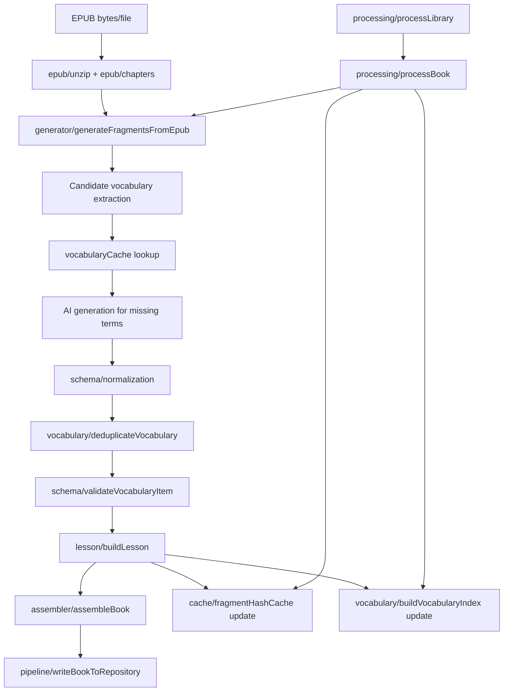

```mermaid
flowchart TD
  A[EPUB bytes/file] --> B[epub/unzip + epub/chapters]
  B --> C[generator/generateFragmentsFromEpub]
  C --> D[Candidate vocabulary extraction]
  D --> E[vocabularyCache lookup]
  E --> F[AI generation for missing terms]
  F --> G[schema/normalization]
  G --> H[vocabulary/deduplicateVocabulary]
  H --> I[schema/validateVocabularyItem]
  I --> J[lesson/buildLesson]
  J --> K[assembler/assembleBook]
  K --> L[pipeline/writeBookToRepository]

  J --> M[cache/fragmentHashCache update]
  J --> N[vocabulary/buildVocabularyIndex update]

  O[processing/processBook] --> C
  O --> M
  O --> N
  P[processing/processLibrary] --> O

```