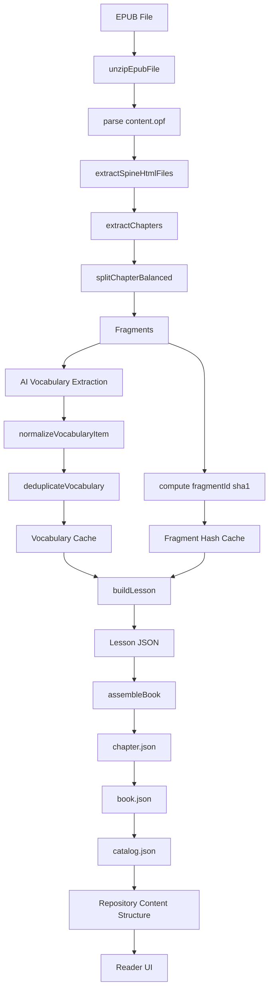

```mermaid
flowchart TD

%% =========================
%% INPUT
%% =========================

EPUB[EPUB File]

%% =========================
%% PARSER LAYER
%% =========================

EPUB --> UNZIP[unzipEpubFile]
UNZIP --> OPF[parse content.opf]
OPF --> SPINE[extractSpineHtmlFiles]
SPINE --> CHAPTERS[extractChapters]

%% =========================
%% FRAGMENT ENGINE
%% =========================

CHAPTERS --> SPLIT[splitChapterBalanced]
SPLIT --> FRAGMENTS[Fragments]

%% =========================
%% HASH ENGINE
%% =========================

FRAGMENTS --> HASH[compute fragmentId sha1]
HASH --> HASHCACHE[Fragment Hash Cache]

%% =========================
%% VOCABULARY ENGINE
%% =========================

FRAGMENTS --> AI[AI Vocabulary Extraction]

AI --> NORMALIZE[normalizeVocabularyItem]
NORMALIZE --> DEDUP[deduplicateVocabulary]
DEDUP --> VOCABCACHE[Vocabulary Cache]

%% =========================
%% LESSON BUILDER
%% =========================

VOCABCACHE --> LESSON[buildLesson]

HASHCACHE --> LESSON

LESSON --> LESSONJSON[Lesson JSON]

%% =========================
%% ASSEMBLER
%% =========================

LESSONJSON --> ASSEMBLER[assembleBook]

ASSEMBLER --> CHAPTERMANIFEST[chapter.json]
CHAPTERMANIFEST --> BOOKMANIFEST[book.json]
BOOKMANIFEST --> CATALOG[catalog.json]

%% =========================
%% REPOSITORY
%% =========================

CATALOG --> REPO[Repository Content Structure]

%% =========================
%% READER
%% =========================

REPO --> READER[Reader UI]
```