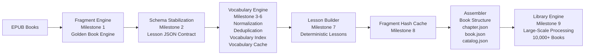

```mermaid
flowchart LR

%% =========================
%% INPUT
%% =========================

EPUB[EPUB Books]

%% =========================
%% MILESTONE 1
%% =========================

EPUB --> FRAGMENTS

FRAGMENTS[Fragment Engine
Milestone 1
Golden Book Engine]

%% =========================
%% MILESTONE 2
%% =========================

FRAGMENTS --> SCHEMA

SCHEMA[Schema Stabilization
Milestone 2
Lesson JSON Contract]

%% =========================
%% MILESTONE 3
%% =========================

SCHEMA --> VOCAB

VOCAB[Vocabulary Engine
Milestone 3-6
Normalization
Deduplication
Vocabulary Index
Vocabulary Cache]

%% =========================
%% MILESTONE 7
%% =========================

VOCAB --> LESSON

LESSON[Lesson Builder
Milestone 7
Deterministic Lessons]

%% =========================
%% MILESTONE 8
%% =========================

LESSON --> HASH

HASH[Fragment Hash Cache
Milestone 8]

%% =========================
%% ASSEMBLER
%% =========================

HASH --> BOOK

BOOK[Assembler
Book Structure
chapter.json
book.json
catalog.json]

%% =========================
%% FINAL SYSTEM
%% =========================

BOOK --> LIBRARY

LIBRARY[Library Engine
Milestone 9
Large-Scale Processing
10,000+ Books]
```