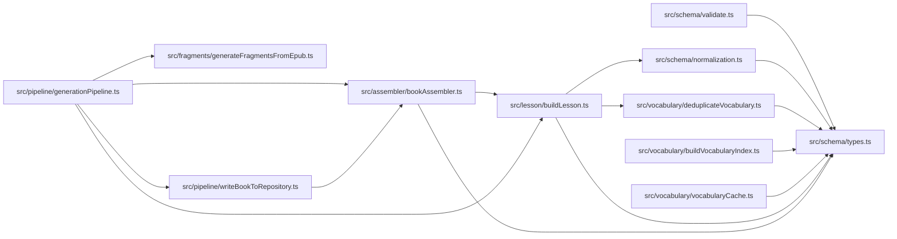

```mermaid
flowchart LR

%% =========================
%% CORE SCHEMA
%% =========================

TYPES[src/schema/types.ts]
VALIDATE[src/schema/validate.ts]
NORMALIZE[src/schema/normalization.ts]

%% =========================
%% FRAGMENT ENGINE
%% =========================

FRAGMENTS[src/fragments/generateFragmentsFromEpub.ts]

%% =========================
%% VOCABULARY ENGINE
%% =========================

DEDUP[src/vocabulary/deduplicateVocabulary.ts]
INDEX[src/vocabulary/buildVocabularyIndex.ts]
CACHE[src/vocabulary/vocabularyCache.ts]

%% =========================
%% LESSON BUILDER
%% =========================

LESSON[src/lesson/buildLesson.ts]

%% =========================
%% ASSEMBLER
%% =========================

ASSEMBLER[src/assembler/bookAssembler.ts]

%% =========================
%% PIPELINE
%% =========================

PIPELINE[src/pipeline/generationPipeline.ts]
WRITE[src/pipeline/writeBookToRepository.ts]

%% =========================
%% DEPENDENCIES
%% =========================

VALIDATE --> TYPES
NORMALIZE --> TYPES

DEDUP --> TYPES
INDEX --> TYPES
CACHE --> TYPES

LESSON --> TYPES
LESSON --> NORMALIZE
LESSON --> DEDUP

ASSEMBLER --> TYPES
ASSEMBLER --> LESSON

PIPELINE --> FRAGMENTS
PIPELINE --> LESSON
PIPELINE --> ASSEMBLER
PIPELINE --> WRITE

WRITE --> ASSEMBLER
```